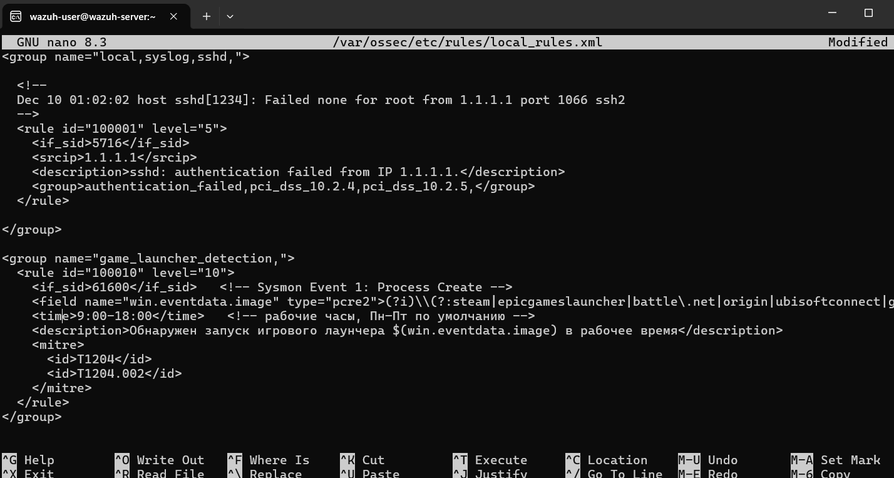
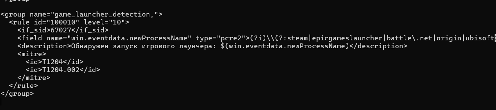
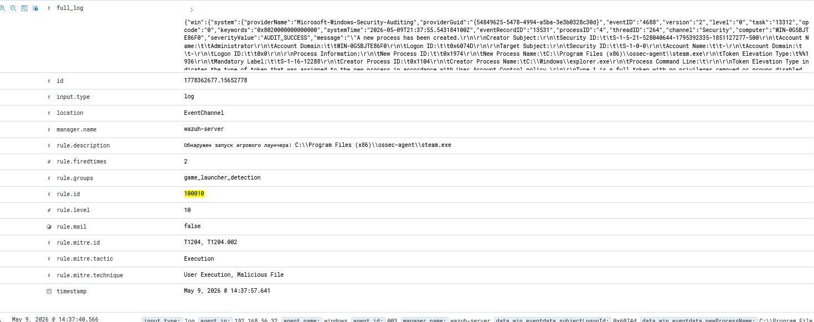
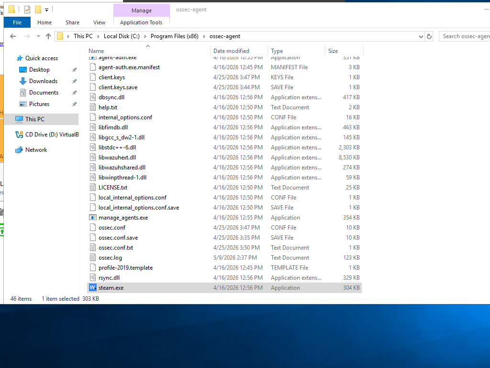
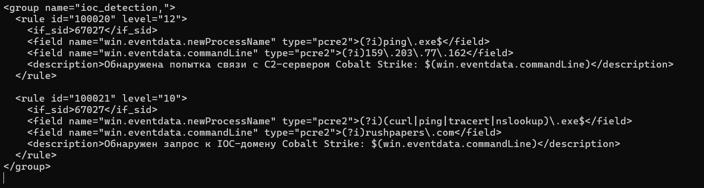
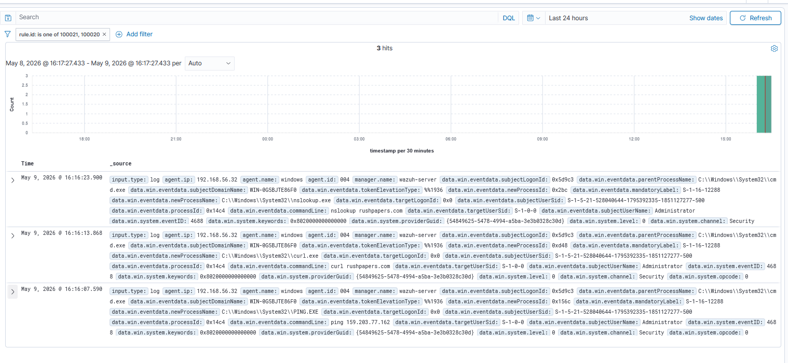
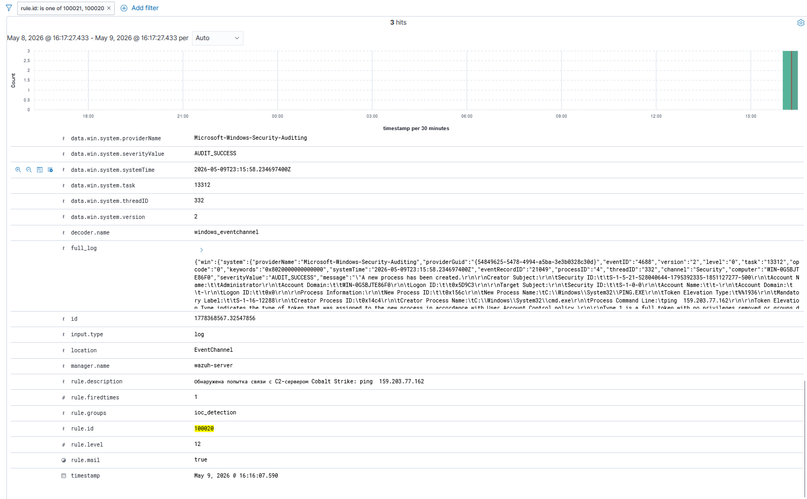
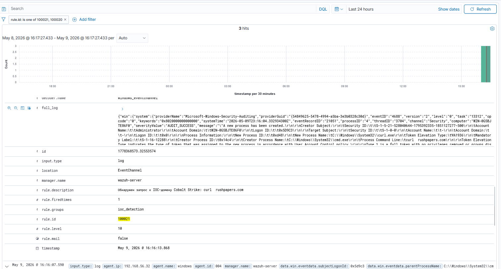

# Лабораторная работа №3
**Дисциплина:** Современные технологии ИБ  
**Тема:** Создание пользовательских правил корреляции и детектирование IOC  
**Вариант:** 4  
**Выполнил:** Фролкин Никита, Кирилл Трофимов

---

## Состав стенда
Использован стенд, развёрнутый в лабораторной работе №2.

| Машина | ОС | IP-адрес (Host-Only) | Роль |
|--------|----|-----------------------|------|
| wazuh-server | Amazon Linux 2023 (OVA) | 192.168.56.31 | Сервер Wazuh (менеджер, индексатор, дашборд) |
| ubuntu-agent | Ubuntu Server 24.04 | 192.168.56.30 | Агент Wazuh, сбор логов auditd, syslog |
| windows-agent | Windows Server 2022 (Desktop Experience) | 192.168.56.32 | Агент Wazuh, сбор логов Security, Sysmon (опционально) |

Все машины подключены к виртуальной сети Internal network (intnet) и при необходимости имеют доступ в интернет через сетевой мост.

---

## Часть 1. Детектирование игровых лаунчеров в рабочее время

### Сценарий (вариант 4)
Сотрудник компании-разработчика ПО в рабочее время запускает игры через популярные игровые лаунчеры (Steam, Epic Games Launcher, Battle.net, Origin, Ubisoft Connect, GOG Galaxy). Требуется разработать корреляционное правило, детектирующее факт запуска таких лаунчеров.

### Реализованное правило
Создано правило в файле `/var/ossec/etc/rules/local_rules.xml` на сервере Wazuh. Оно использует события создания процессов Windows (Event ID 4688, правило Wazuh 67027) и проверяет поле `win.eventdata.newProcessName` на наличие известных имён лаунчеров.

Полный XML-код правила:

```xml
<group name="game_launcher_detection,">
  <rule id="100010" level="10">
    <if_sid>67027</if_sid>
    <field name="win.eventdata.newProcessName" type="pcre2">(?i)\\(?:steam|epicgameslauncher|battle\.net|origin|ubisoftconnect|galaxyclient)\.exe$</field>
    <description>Обнаружен запуск игрового лаунчера: $(win.eventdata.newProcessName)</description>
    <mitre>
      <id>T1204</id>
      <id>T1204.002</id>
    </mitre>
  </rule>
</group>
```

### Примечание относительно ограничения по времени
Согласно сценарию необходимо детектировать запуски в рабочее время. Однако на стенде использовались виртуальные машины с несинхронизированными системными часами, а Wazuh-сервер и агенты находились в разных часовых поясах. Введение временного фильтра (`<time>09:00-18:00</time>`) могло привести к ложным срабатываниям или пропуску событий при тестировании. Поэтому для чистоты эксперимента правило оставлено без временного ограничения – оно детектирует запуск лаунчеров в любое время суток. В продуктивной среде достаточно добавить тег `<time>` после синхронизации времени (NTP) на всех узлах.

### Скриншоты
1. Правило в файле local_rules.xml:  
   



2. Алерт в Wazuh Dashboard при запуске `steam.exe`:  
   


---

## Часть 2. Мониторинг IOC на основе TI-отчёта

### Источник Threat Intelligence
Для выделения индикаторов компрометации использован публичный отчёт Rapid7 **«Innovative Tunnelling and Forensic Tool Abuse: IR Tales from the Field»** (опубликован 17.06.2025, обновлён 08.04.2026).  
Ссылка: https://www.rapid7.com/blog/post/innovative-tunnelling-and-forensic-tool-abuse-ir-tales-from-the-field/

В отчёте описан инцидент, связанный с попыткой использования Cobalt Strike после компрометации среды. Из раздела *Indicators of compromise* были выбраны два IOC с учётом их контекста:

| Индикатор | Тип | Контекст (описание из отчёта) |
|-----------|-----|-------------------------------|
| `159.203.77.162` | IP-адрес | Внешний C2 IP-адрес, закодированный в PowerShell-команде маяка Cobalt Strike |
| `rushpapers.com` | Домен | Домен, в который разрешался C2 IP-адрес на момент активности |

**Обоснование выбора:**  
- IP-адрес используется как **целевой** для исходящих соединений к C2-серверу (T1071 – Command & Control).  
- Домен также связан с C2 и может применяться для обхода блокировок по IP.  
Оба индикатора непосредственно относятся к Cobalt Strike – инструменту, широко применяемому злоумышленниками для закрепления и удалённого управления.

### Реализованные правила корреляции
Так как на агенте Windows не был развёрнут Sysmon, но был включён расширенный аудит создания процессов (Event ID 4688) с записью командной строки, правила опираются на стандартные события Security. Для корректной работы в локальных политиках безопасности активирована запись аргументов командной строки (`ProcessCreationIncludeCmdLine_Enabled = 1`).

Правила добавлены в `local_rules.xml` на сервере Wazuh. Каждое проверяет имя процесса и наличие IOC в командной строке.

#### Правило 100020 (детект обращения к C2 IP)

```xml
<rule id="100020" level="12">
  <if_sid>67027</if_sid>
  <field name="win.eventdata.newProcessName" type="pcre2">(?i)ping\.exe$</field>
  <field name="win.eventdata.commandLine" type="pcre2">(?i)159\.203\.77\.162</field>
  <description>Обнаружена попытка связи с C2-сервером Cobalt Strike: $(win.eventdata.commandLine)</description>
  <mitre>
    <id>T1059.001</id>
  </mitre>
</rule>
```

#### Правило 100021 (детект DNS-запроса к вредоносному домену)

```xml
<rule id="100021" level="10">
  <if_sid>67027</if_sid>
  <field name="win.eventdata.newProcessName" type="pcre2">(?i)(curl|ping|tracert|nslookup)\.exe$</field>
  <field name="win.eventdata.commandLine" type="pcre2">(?i)rushpapers\.com</field>
  <description>Обнаружен запрос к IOC-домену Cobalt Strike: $(win.eventdata.commandLine)</description>
  <mitre>
    <id>T1071.001</id>
  </mitre>
</rule>
```

Оба правила содержатся в группе `ioc_detection`.

### Генерация тестовой активности
На Windows-агенте последовательно выполнены команды:

```cmd
ping 159.203.77.162
curl rushpapers.com
```

События 4688 записались с заполненной командной строкой, были отправлены на сервер Wazuh и вызвали срабатывание правил 100020 и 100021.

### Скриншоты
3. Правила IOC в файле local_rules.xml:  
   



4. Алерт 100020 (обнаружение C2 IP):  
   

5. Алерт 100021 (обнаружение домена):  
   

---

## Выводы

В ходе лабораторной работы:
- Разработано и проверено пользовательское правило корреляции для детектирования запуска игровых лаунчеров (Steam, Epic Games и др.) на основе событий создания процессов Windows.
- Продемонстрирована гибкость Wazuh: правило может быть легко дополнено тегом `<time>` после синхронизации времени на всех узлах.
- Изучен TI-отчёт Rapid7, извлечены актуальные индикаторы компрометации (IP и домен Cobalt Strike).
- Реализованы корреляционные правила, детектирующие попытки сетевого взаимодействия с данными IOC через анализ командной строки стандартных утилит (`ping`, `nslookup`, `curl`).
